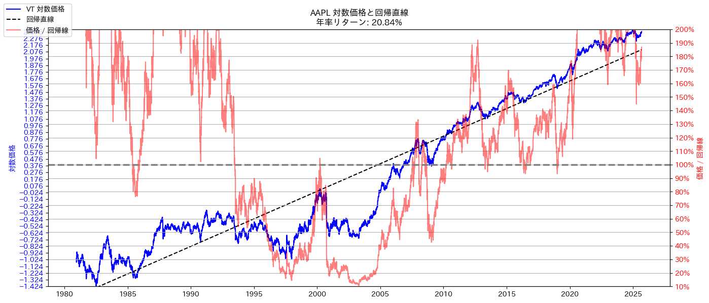

# 金融データ分析による積立投資戦略の考察

yfinanceライブラリを用いて各種金融商品の価格推移データを取得し、市場平均を超えるパフォーマンスを目指す積立投資戦略について分析・考察するプロジェクトです。

---

## ✨ 主な内容

* **データ取得**: `yfinance`を利用して、S&P 500 (VOO)や全世界株式(VT)などの株価・ETFの時系列データを取得します。
* **データ分析**: Jupyter Notebookを使い、取得したデータを可視化し、リターンやリスクなどの基本的な分析を行います。
* **戦略考察**: 単純なドルコスト平均法（定期積立）に加え、下落局面で投資額を増やすなどの戦略がパフォーマンスに与える影響をシミュレーションし、比較・考察します。

---

## 🚀 セットアップ方法

**1. リポジトリをクローンして移動**

```bash
git clone [https://github.com/miuraDS/financial_analytics.git](https://github.com/miuraDS/financial_analytics.git)
cd financial_analytics
````

**2. 仮想環境の作成**
`uv` を使って、プロジェクト用の仮想環境を作成します。

```bash
uv venv
```

**3. 仮想環境の有効化**

```bash
# macOS / Linux
source .venv/bin/activate

# Windows (Command Prompt)
.venv\Scripts\activate
```

**4. ライブラリのインストール**
`pyproject.toml` と `uv.lock` を基に、プロジェクトと全く同じバージョンのライブラリをインストールします。

```bash
uv pip sync
```

-----

## 📊 分析例

プロジェクト内のNotebookでは、以下のような分析を行っています。

**各金融資産の対数価格の回帰分析**
対数価格の回帰直線を可視化し、その傾きから平均的な年間リターン（ドリフト率）を概算します。



-----

## 📂 ディレクトリ構成

```plaintext
financial_analytics/
├── .venv/               # 仮想環境 (uvが作成)
├── data/                # 分析用データ（.gitignoreで管理対象外）
├── notebooks/           # Jupyter Notebookを格納
│   └── financial_analytics.ipynb
├── src/                 # 再利用するPythonソースコード
│   └── data_loader.py
├── images/              # README.mdに挿入する画像
├── .gitignore           # Gitの追跡から除外するファイルリスト
├── pyproject.toml       # プロジェクトの依存関係リスト
├── uv.lock              # 依存関係の正確なバージョンロックファイル
└── README.md            # このファイル
```
